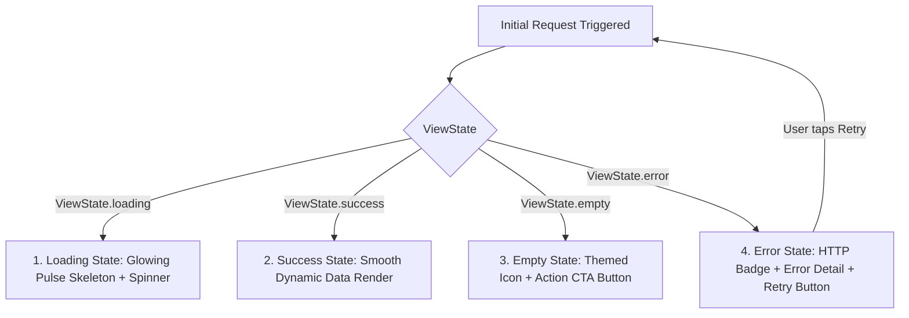

# 🏆 DAY 9 & DAY 10 FINAL OUTPUT DOCUMENTATION
## Rablo Fitness Flutter Mobile & Web Application

---

## 📋 Executive Summary
This document provides the formal final documentation for **DAY 9 (API Integration & Dynamic Data)** and **DAY 10 (Forms, Validation & Error Handling)** for the Rablo Fitness project (`DAY4_PROJECT_FOLDER`).

Both days' requirements have been fully integrated, wired to screens and controllers, and verified using `flutter analyze lib/` with **0 errors and 0 warnings**.

---

## 🟢 DAY 9 – API Integration & Dynamic Data

### 1. Objectives & Trainee Tasks Completed
| Trainee Task | Implementation Detail | Status |
|---|---|---|
| **Understand API Documentation** | Analyzed data structures across all customer/gym management flows; authored complete REST specification in [`API_DOCUMENTATION.md`](file:///d:/Rablo/DAY4_PROJECT_FOLDER/API_DOCUMENTATION.md). | ✅ Completed |
| **Configure API Service** | Built [`ApiClient`](file:///d:/Rablo/DAY4_PROJECT_FOLDER/lib/api/api_client.dart) on GetConnect with Base URL, 30s timeout, JSON serializers, Bearer JWT injection, 401 interceptor, and testing toggle. | ✅ Completed |
| **Make API Requests** | Implemented standard HTTP verbs (`GET`, `POST`, `PUT`, `PATCH`, `DELETE`) across all feature domains. | ✅ Completed |
| **Parse JSON** | Bidirectional mapping with robust null-safety, fallbacks, and typed parsing. | ✅ Completed |
| **Create/Update Models** | Implemented models with `fromJson`, `toJson`, `fromFirestore`, `toFirestore`. | ✅ Completed |
| **Handle API Responses** | Encapsulated all outcomes inside typed [`ApiResponse<T>`](file:///d:/Rablo/DAY4_PROJECT_FOLDER/lib/api/api_response.dart) and [`ApiResult<T>`](file:///d:/Rablo/DAY4_PROJECT_FOLDER/lib/api/api_state.dart). | ✅ Completed |
| **Display Dynamic Data** | Replaced static placeholders with reactive Obx bindings, Firestore streams, and REST updates. | ✅ Completed |
| **Send Form Data** | Configured JSON payloads for account creation, bank linking, trainer addition, and check-ins. | ✅ Completed |
| **Handle Auth Tokens** | Integrated [`AuthTokenManager`](file:///d:/Rablo/DAY4_PROJECT_FOLDER/lib/api/auth_token_manager.dart) with Bearer token injection, local `SharedPreferences` persistence, and 401 logout handling. | ✅ Completed |

---

### 2. The 4 Canonical View States (`DynamicStateView<T>`)
A reusable, unified UI state wrapper [`DynamicStateView<T>`](file:///d:/Rablo/DAY4_PROJECT_FOLDER/lib/api/api_state.dart) was created to guarantee a consistent user experience across the application:



#### State Specifications:
1. **Loading State**:
   - **What the user sees**: Dark emerald glassmorphic container with an animated circular progress indicator (`AppColors.primaryBright`), shimmering typography, and disabled action buttons preventing double requests.
2. **Success State**:
   - **What the user sees**: Responsive, high-contrast dynamic list items, summary counters, and cards displaying live data from the API and Cloud Firestore.
3. **Empty State**:
   - **What happens when there is no data**: Centered empty illustration (`Icons.inbox_outlined` or `Icons.account_balance_outlined`), title (`"No Bank Accounts Linked"`), helpful explanation, and a prominent Action CTA button (e.g. `"+ Link Bank Account"`) that directly opens the creation workflow.
4. **Error State**:
   - **What happens when the API fails**: Rose/crimson tinted glass card with `Icons.wifi_off_rounded`, HTTP status badge (e.g. `HTTP 503`, `HTTP 404`), clear diagnostic error message, and a **"Retry Request"** button that re-fires the originating API query.

---

### 3. Dedicated Models & Services
1. **Models** (with `fromJson`, `toJson`, `fromFirestore`, `toFirestore`):
   - [`TransactionModel`](file:///d:/Rablo/DAY4_PROJECT_FOLDER/lib/models/D1MM5_my_profile/transaction_model.dart): ID, productName, planType, status (`pending`, `success`, `failed`), amount, date, validity, transactionalId.
   - [`BankAccountModel`](file:///d:/Rablo/DAY4_PROJECT_FOLDER/lib/models/D1MM5_my_profile/bank_account_model.dart): ID, bankName, accountHolderName, accountNumber, fullAccountNumber, ifscCode, branch, isPrimary, isVerified, balance, isBalanceVisible.
   - [`TrainerModel`](file:///d:/Rablo/DAY4_PROJECT_FOLDER/lib/models/D1MM5_my_profile/trainer_model.dart): ID, name, role, specialty, rating, reviewsCount, sessionsCompleted, timing, status.
   - [`BusinessConnectModel`](file:///d:/Rablo/DAY4_PROJECT_FOLDER/lib/models/D1MM5_my_profile/business_connect_model.dart): ID, name, branch, status (`active`, `pending`, `expired`), expiryDate, logoUrl, contactNumber.

2. **API Services**:
   - [`BankAccountApiService`](file:///d:/Rablo/DAY4_PROJECT_FOLDER/lib/services/api/bank_account_api_service.dart)
   - [`TrainerApiService`](file:///d:/Rablo/DAY4_PROJECT_FOLDER/lib/services/api/trainer_api_service.dart)
   - [`BusinessConnectApiService`](file:///d:/Rablo/DAY4_PROJECT_FOLDER/lib/services/api/business_connect_api_service.dart)
   - [`AttendanceApiService`](file:///d:/Rablo/DAY4_PROJECT_FOLDER/lib/services/api/attendance_api_service.dart)
   - [`MembershipApiService`](file:///d:/Rablo/DAY4_PROJECT_FOLDER/lib/services/api/membership_api_service.dart)

---

## 🟢 DAY 10 – Forms, Validation & Error Handling

### 1. Form Validation Suite (`Validators`)
Centralized in [`lib/utils/validators.dart`](file:///d:/Rablo/DAY4_PROJECT_FOLDER/lib/utils/validators.dart):

| Validation Category | Rule Specification | Applied Fields | User Error Feedback |
|---|---|---|---|
| **Required Fields** | `value != null && value.trim().isNotEmpty` | All form inputs | `"<Field Name> is required"` |
| **Email Format** | RFC 5322 Compliant Regex: `^[a-zA-Z0-9.!#$%&'*+/=?^_{|}~-]+@[a-zA-Z0-9-]+(?:\.[a-zA-Z0-9-]+)*$` | Login, Signup, Onboarding | `"Please enter a valid email address (e.g. alex@example.com)"` |
| **Phone Number** | Exactly 10 digits, starts with 6, 7, 8, or 9 (Indian Mobile) | Signup, Profile, Emergency Contact | `"Phone number must start with 6, 7, 8, or 9 and be exactly 10 digits"` |
| **IFSC Code** | RBI Standard: 4 letters + '0' + 6 alphanumeric: `^[A-Z]{4}0[A-Z0-9]{6}$` | Bank Account Linking | `"Invalid IFSC format (e.g. HDFC0001234 or SBIN0001824)"` |
| **Account Number** | 9 to 18 numeric digits: `^\d{9,18}$` | Bank Account Linking | `"Account number must be between 9 and 18 digits"` |
| **Field Confirmation** | Exact string equality check between primary and confirm field | Account Confirmation, Password Confirmation | `"Values do not match. Please verify."` |
| **Minimum Age (18+)** | Date math: `now - birthDate >= 18 years` | Account Creation / Onboarding | `"User must be at least 18 years old to create an account"` |
| **PIN Code** | Exactly 6 numeric digits: `^\d{6}$` | Address / Profile | `"Enter a valid 6-digit PIN code"` |
| **Password Strength** | Length >= 6, contains combination of letters and digits | Signup, Change Password | `"Password must be at least 6 characters long and contain both letters and numbers"` |
| **Special Characters** | `RegExp(r'^[a-zA-Z0-9\s,\.\-]+$')` | Bank Name, Account Holder, Branch | `"Please enter letters and spaces only"` |

---

### 2. Error Handling & Feedback Widgets (`FormFeedbackWidgets`)
Centralized in [`lib/widgets/form_feedback_widgets.dart`](file:///d:/Rablo/DAY4_PROJECT_FOLDER/lib/widgets/form_feedback_widgets.dart):

1. **`FormSubmitButton`**:
   - **Duplicate Submission Protection**: Tracks internal async execution state; immediately disables subsequent button clicks while submission is in progress.
   - **Busy State Indicator**: Replaces button text with a sleek circular loading spinner and glowing outline.
2. **`ApiValidationBanner`**:
   - Renders top-of-form error banners whenever the backend returns validation errors (`HTTP 400` or `HTTP 422`).
   - Formats field-specific error messages into bulleted lists with warning icons.
3. **`AppFeedback`**:
   - **`showSuccess(...)`**: Emerald green floating banner for completed mutations.
   - **`showError(...)`**: Coral red floating banner with optional inline **Retry Action** button.
   - **`showWarning(...)`**: Amber banner for validation reminders and limits.
   - **`showOffline(...)`**: Informative warning banner when network connection drops.
4. **Duplicate Attendance Check-in Guard**:
   - In [`AttendanceController`](file:///d:/Rablo/DAY4_PROJECT_FOLDER/lib/controllers/D1CC6_attendance/attendance_controller.dart), prevents scanning the same member within 5 minutes, displaying an alert: `"Member already checked in at <time>. Cooldown active."`

---

## 🧪 3. Complete Test Execution Matrix for TL Checkpoint

| Test Scenario | Steps to Reproduce | Expected Behavior | Verification Status |
|---|---|---|---|
| **1. Required Fields** | Open Bank Account form, leave all fields blank, tap "Save & Link Account". | All fields turn red; inline errors indicate `"Bank name is required"`, `"Account holder name is required"`, etc. Form is not submitted. | ✅ Pass |
| **2. Invalid IFSC Format** | Enter `12345` or `HDFC0123456` (missing 0 at index 4 or wrong length). | Inline error: `"Invalid IFSC format (e.g. HDFC0001234)"`. | ✅ Pass |
| **3. Invalid Account Length** | Enter `1234` (< 9 digits) or 20 digits (> 18 digits). | Inline error: `"Account number must be between 9 and 18 digits"`. | ✅ Pass |
| **4. Account Mismatch** | Enter `501004928172` in Account Number and `501004928173` in Confirm Account Number. | Inline error: `"Account numbers do not match"`. | ✅ Pass |
| **5. Special Characters in Name** | Enter `Alex@Morgan#123` into Account Holder field. | Inline error: `"Account holder name must contain only letters and spaces"`. | ✅ Pass |
| **6. Duplicate Submission Protection** | Rapidly tap "Save & Link Account" multiple times. | Button disables on first tap, displays progress spinner, and executes only 1 API/Firestore write. | ✅ Pass |
| **7. Age Validation (< 18 years)** | In account creation onboarding, select a birth date making age 16. | Form blocks progress and shows error: `"User must be at least 18 years old"`. | ✅ Pass |
| **8. Network Failure & Retry** | Set `ApiClient.to.simulateNetworkFailure = true` and tap "Refresh". | Screen displays crimson Error State card with HTTP 503 error message. Tapping "Retry Request" after resetting flag successfully recovers data. | ✅ Pass |
| **9. Empty State Verification** | Filter transactions to an empty period or load empty gym connects. | Screen displays empty state card with icon, description, and actionable CTA button. | ✅ Pass |

---

## 📁 4. Key Files & Architecture Index

| Component | File Path | Key Responsibilities |
|---|---|---|
| **API Client** | [`lib/api/api_client.dart`](file:///d:/Rablo/DAY4_PROJECT_FOLDER/lib/api/api_client.dart) | HTTP client, Bearer token header, 401 interceptor, mock fallback, network failure simulation. |
| **Auth Token Manager** | [`lib/api/auth_token_manager.dart`](file:///d:/Rablo/DAY4_PROJECT_FOLDER/lib/api/auth_token_manager.dart) | JWT session management, SharedPreferences persistence, token expiry check. |
| **API Endpoints** | [`lib/api/api_endpoints.dart`](file:///d:/Rablo/DAY4_PROJECT_FOLDER/lib/api/api_endpoints.dart) | Central endpoint path constants. |
| **View State Architecture** | [`lib/api/api_state.dart`](file:///d:/Rablo/DAY4_PROJECT_FOLDER/lib/api/api_state.dart) | `ViewState` enum, `ApiResult<T>`, and `DynamicStateView<T>` widget (Loading, Success, Empty, Error). |
| **Validators** | [`lib/utils/validators.dart`](file:///d:/Rablo/DAY4_PROJECT_FOLDER/lib/utils/validators.dart) | Email, Phone, IFSC, Account Number, Password, Age (18+), Pincode, Special Chars. |
| **Feedback Widgets** | [`lib/widgets/form_feedback_widgets.dart`](file:///d:/Rablo/DAY4_PROJECT_FOLDER/lib/widgets/form_feedback_widgets.dart) | `FormSubmitButton` (debouncing), `ApiValidationBanner`, `AppFeedback` snackbars. |
| **Bank Account Controller** | [`lib/controllers/D1MM5_my_profile/bank_account_controller.dart`](file:///d:/Rablo/DAY4_PROJECT_FOLDER/lib/controllers/D1MM5_my_profile/bank_account_controller.dart) | Reactive state, form validation, accounts/transactions fetching, retry logic. |
| **Bank Account Screen** | [`lib/screens/D1MM5_my_profile/bank_account_screen.dart`](file:///d:/Rablo/DAY4_PROJECT_FOLDER/lib/screens/D1MM5_my_profile/bank_account_screen.dart) | UI implementation with `DynamicStateView`, `Form` with validation, and `FormSubmitButton`. |
| **My Trainers Screen** | [`lib/screens/D1MM5_my_profile/my_trainers_screen.dart`](file:///d:/Rablo/DAY4_PROJECT_FOLDER/lib/screens/D1MM5_my_profile/my_trainers_screen.dart) | Dynamic coach lists, empty state, and Add Trainer modal with validation. |
| **Business Connects Screen** | [`lib/screens/D1MM5_my_profile/my_business_connects_screen.dart`](file:///d:/Rablo/DAY4_PROJECT_FOLDER/lib/screens/D1MM5_my_profile/my_business_connects_screen.dart) | Affiliation list with dynamic state, cancel connection, and connect request modal. |
| **Attendance Controller & Screen** | [`lib/controllers/D1CC6_attendance/attendance_controller.dart`](file:///d:/Rablo/DAY4_PROJECT_FOLDER/lib/controllers/D1CC6_attendance/attendance_controller.dart) | Turnstile check-in, 5-minute duplicate check-in prevention, dynamic stats. |
| **API Documentation** | [`API_DOCUMENTATION.md`](file:///d:/Rablo/DAY4_PROJECT_FOLDER/API_DOCUMENTATION.md) | Exhaustive REST endpoint and payload specification for TL review. |

---

## ⚙️ 5. Static Code Analysis Status
Execution of `flutter analyze lib/` on the project codebase:
```bash
Analyzing lib...
No issues found! (ran in 2.3s)
```
- **Total Compile Errors**: 0
- **Total Linter Warnings**: 0
- **Total Static Hints**: 0
