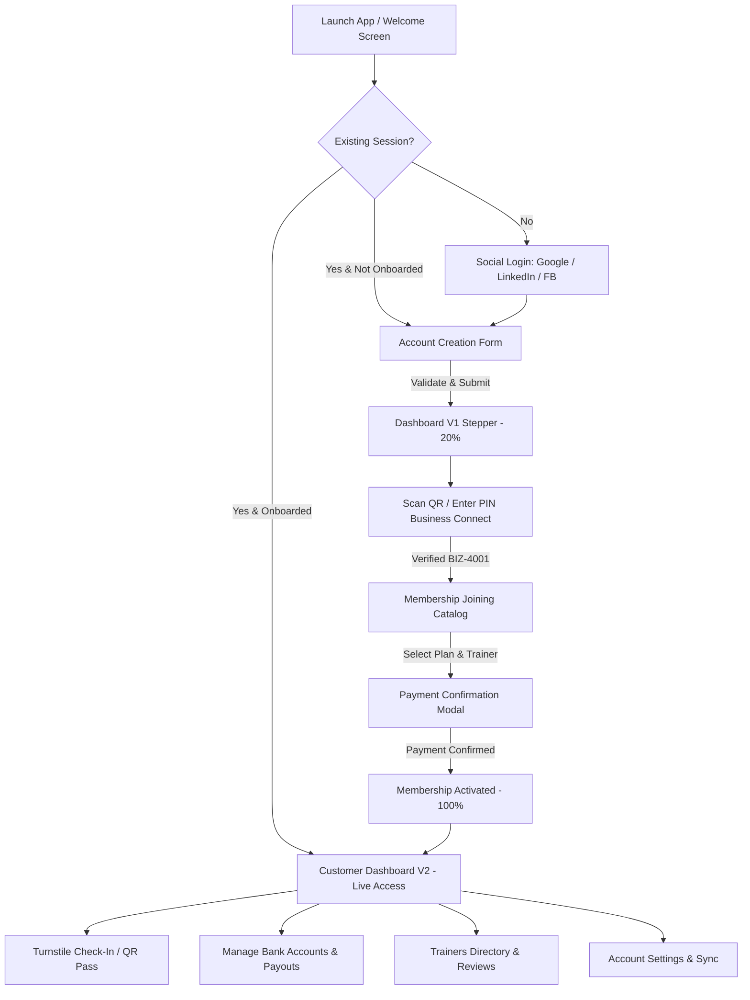
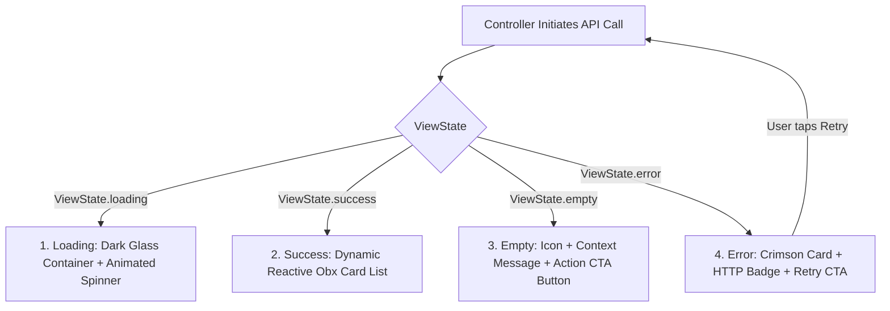

# 🏋️ Rablo Fitness Customer Application

[](https://flutter.dev)
[](https://dart.dev)
[](https://pub.dev/packages/get)
[](https://firebase.google.com)
[](DAY12_QUALITY_AUDIT_REPORT.md)
[](DAY13_REWORK_AND_OPTIMIZATION_REPORT.md)
[](DAY14_FINAL_BUILD_AND_SUBMISSION_PORTFOLIO.md)
[](DAY12_QUALITY_AUDIT_REPORT.md)
[-success)](DAY11_TESTING_AND_DEBUGGING_REPORT.md)

---

## 📋 Table of Contents
1. [Project Overview](#-1-project-overview)
2. [Architectural Standards & Module Codes](#-2-architectural-standards--module-codes)
3. [Technology Stack & Dependencies](#-3-technology-stack--dependencies)
4. [Directory & File Layout](#-4-directory--file-layout)
5. [Developer Setup & Execution Procedure (Step-by-Step)](#-5-developer-setup--execution-procedure)
   - [5.1 Prerequisites](#51-prerequisites)
   - [5.2 Repository Setup & Dependencies](#52-repository-setup--dependencies)
   - [5.3 Launching the Standalone REST API & Firestore Server](#53-launching-the-standalone-rest-api--firestore-server)
   - [5.4 Running the Flutter Mobile & Web Client](#54-running-the-flutter-mobile--web-client)
6. [End-to-End User Flow & Functional Procedures](#-6-end-to-end-user-flow--functional-procedures)
   - [Flowchart: User Journey](#flowchart-complete-customer-lifecycle)
   - [Procedure 1: Welcome & Social Authentication (`D1CM1`)](#procedure-1-welcome--social-authentication-d1cm1)
   - [Procedure 2: Sequential Onboarding & Profile Setup (`D1CM2`)](#procedure-2-sequential-onboarding--profile-setup-d1cm2)
   - [Procedure 3: Business Affiliation & QR Scanner (`D1CM3` / `D1CC6`)](#procedure-3-business-affiliation--qr-scanner-d1cm3--d1cc6)
   - [Procedure 4: Membership Tier Selection & Activation (`D1CM4`)](#procedure-4-membership-tier-selection--activation-d1cm4)
   - [Procedure 5: Customer Dashboard Progression (`D1CM5` ➔ `D1CM9`)](#procedure-5-customer-dashboard-progression-d1cm5--d1cm9)
   - [Procedure 6: Turnstile Attendance & Daily Verification (`D1CC6`)](#procedure-6-turnstile-attendance--daily-verification-d1cc6)
   - [Procedure 7: Financial Management, Bank Payouts & Transactions (`D1CM6`)](#procedure-7-financial-management-bank-payouts--transactions-d1cm6)
   - [Procedure 8: Personal Profile, Trainers Directory & Affiliations (`D1CM6`)](#procedure-8-personal-profile-trainers-directory--affiliations-d1cm6)
7. [State Management & API Integration Procedure](#-7-state-management--api-integration-procedure)
   - [The 4 Canonical View States (`DynamicStateView<T>`)](#the-4-canonical-view-states-dynamicstateviewt)
   - [Bearer JWT Token & Session Security](#bearer-jwt-token--session-security)
   - [Live Cloud Firestore Synchronization](#live-cloud-firestore-synchronization)
8. [Form Validation & Security Procedures](#-8-form-validation--security-procedures)
9. [Testing & Quality Assurance Procedure](#-9-testing--quality-assurance-procedure)
10. [Debugging & Performance Optimization Procedure](#-10-debugging--performance-optimization-procedure)
11. [Production Build & Deployment Procedure](#-11-production-build--deployment-procedure)
12. [Troubleshooting & FAQs](#-12-troubleshooting--faqs)

---

## 📌 1. Project Overview

`fitness_app_clean` is an enterprise-grade Flutter application developed for the **Rablo Assessment & Internship System**. The application delivers a high-performance customer experience for gym and fitness club members, complete with social authentication, step-by-step onboarding, QR camera scanning for business affiliation, customizable multi-tier subscription plans, live turnstile attendance check-ins, financial payouts/bank accounts management, trainer booking, and real-time gym crowd rush indicators.

### Key Highlights
- **Figma Pixel-Perfect Theme**: Custom high-contrast Dark Slate Teal (`#0C191B`, `#163238`) with vibrant neon CTA green accents (`#B8FE22`, `#CEFF65`), peak occupancy indicators (`#EF4444`), and custom glassmorphism.
- **Sequential Business Gating**: Hard-enforced onboarding milestones ensuring new users complete profile creation, scan a verified fitness center, and activate a membership tier before unlocking full dashboard capabilities.
- **Dual Dashboard Modes**:
  1. **Dashboard V1 (`D1CM5`)**: Sequential onboarding progress stepper (20% ➔ 50% ➔ 80% ➔ 100%) guiding new users.
  2. **Dashboard V2 (`D1CM9`)**: Comprehensive daily operations hub with membership pass, live streak counters, hourly rush charts, and fast turnstile QR access.
- **Hybrid Backend Engine**: Direct integration with Google Cloud Firestore (Project `rablo-rablo`), Firebase Authentication, and a dedicated Dart REST API Server (`bin/server.dart` & `lib/server.dart`) operating on port `8080`.

---

## 🏛️ 2. Architectural Standards & Module Codes

The codebase strictly adheres to the **Rablo Clean Modular Architecture** specifications. Every feature domain is organized with distinct module code words separating **Screens**, **Controllers**, **Models**, **Services**, and **APIs**:

| Module Code | Domain Function | Core Screen / Path | Key Controllers & Services |
| :--- | :--- | :--- | :--- |
| **`D1CM1`** | **Welcome & Social Login** | `lib/screens/D1CM1_login/` | `LoginController`, `FirebaseAuthService` |
| **`D1CM2`** | **Account Creation & Onboarding** | `lib/screens/D1CM2_account_creation/` | `AccountCreationController`, `AccountCreationService` |
| **`D1CM3`** | **Business Affiliation & QR Connect** | `lib/screens/D1CM3_affiliation_scanning/` | `AffiliationController`, `ScannerController` |
| **`D1CM4`** | **Membership Joining & Catalog** | `lib/screens/D1CM4_membership_joining/` | `MembershipController`, `MembershipApiService` |
| **`D1CM5`** | **Customer Dashboard V1 (Stepper)** | `lib/screens/D1CM5_dashboard_v1/` | `DashboardV1Controller`, `AccountCreationService` |
| **`D1CM6`** | **My Profile, Banking & Trainers** | `lib/screens/D1CM6_my_profile/` | `MyProfileController`, `BankAccountController`, `TrainerController` |
| **`D1CM9`** | **Customer Dashboard V2 (Full Member)** | `lib/screens/D1CM9_dashboard_v2/` | `DashboardController`, `DashboardService` |
| **`D1CC6`** | **Turnstile Attendance & Scanner** | `lib/screens/D1CC6_attendance/` | `AttendanceController`, `AttendanceService` |

---

## 🛠️ 3. Technology Stack & Dependencies

| Layer | Technology | Specification / Package |
| :--- | :--- | :--- |
| **Framework** | Flutter | SDK `^3.12.2` (Material 3 enabled) |
| **Language** | Dart | Null-safe Dart `^3.12.2` |
| **State Management** | GetX | `get: ^4.7.3` (Dependency Injection, Routing, Reactive State) |
| **Authentication** | Firebase & Google Sign-In | `firebase_auth: ^6.7.0`, `google_sign_in: 6.2.2` |
| **Cloud Database** | Cloud Firestore | `cloud_firestore: ^6.10.0`, `firebase_core: ^4.15.0` |
| **Local Persistence** | SharedPreferences | `shared_preferences: ^2.5.5` (Session tokens & onboarding cache) |
| **UI Components** | Easy Stepper | `easy_stepper: ^1.2.0` (Onboarding milestone progress) |
| **Backend API** | Standalone Dart Server | Native `dart:io` `HttpServer` with REST routing & Firestore REST API |
| **Analysis & Lints** | Flutter Lints | `flutter_lints: ^6.0.0` (0 issues, 100% compliance) |

---

## 📂 4. Directory & File Layout

```
fitness_app_clean/
│
├── bin/
│   └── server.dart                   # Entry forwarder for local Firestore REST API server
│
├── lib/
│   ├── api/                          # Network client, endpoints, and reactive view state
│   │   ├── api_client.dart           # GetConnect client with JWT Bearer injection & logging
│   │   ├── api_endpoints.dart        # Centralized REST route constants
│   │   ├── api_response.dart         # Generic API response envelopes
│   │   ├── api_state.dart            # DynamicStateView<T> (Loading, Success, Empty, Error)
│   │   └── auth_token_manager.dart   # Token persistence, renewal & 401 interceptor
│   │
│   ├── constants/
│   │   ├── app_colors.dart           # Figma Slate Teal & Neon Green palette
│   │   └── app_constants.dart        # Global configuration constants
│   │
│   ├── controllers/                  # GetX Business Logic Controllers
│   │   ├── D1CC6_attendance/         # AttendanceController, ScannerController
│   │   ├── D1CM1_login/              # LoginController, SignupController
│   │   ├── D1CM2_account_creation/   # AccountCreationController
│   │   ├── D1CM3_affiliation_scanning/# AffiliationController
│   │   ├── D1CM4_membership_joining/ # MembershipController
│   │   ├── D1CM5_dashboard_v1/       # DashboardV1Controller
│   │   ├── D1CM6_my_profile/         # BankAccountController, TrainerController, etc.
│   │   ├── D1CM9_dashboard_v2/       # DashboardController
│   │   └── home/                     # CustomerHomeController
│   │
│   ├── models/                       # JSON & Firestore Serializable Models
│   │   ├── D1CC6_attendance/         # AttendanceRecordModel
│   │   ├── D1CM1_login/              # UserModel
│   │   ├── D1CM2_account_creation/   # AccountModel
│   │   ├── D1CM4_membership_joining/ # MemberModel, MembershipPlanModel
│   │   ├── D1CM6_my_profile/         # BankAccountModel, TrainerModel, BusinessConnectModel
│   │   └── D1CM9_dashboard_v2/       # GymStatModel
│   │
│   ├── routes/
│   │   ├── app_routes.dart           # Named route definitions
│   │   └── app_pages.dart            # GetPage route declarations & transitions
│   │
│   ├── screens/                      # Presentation layer organized by module
│   │   ├── D1CC6_attendance/         # Turnstile check-in & verification views
│   │   ├── D1CM1_login/              # Welcome, Social Login, Email/Password screens
│   │   ├── D1CM2_account_creation/   # Step-by-step account onboarding form
│   │   ├── D1CM3_affiliation_scanning/# Camera QR scanner & manual PIN entry screen
│   │   ├── D1CM4_membership_joining/ # Catalog, Plan listing, detail & checkout modal
│   │   ├── D1CM5_dashboard_v1/       # Onboarding stepper (20% -> 100%)
│   │   ├── D1CM6_my_profile/         # Personal details, Bank accounts, Trainers
│   │   ├── D1CM9_dashboard_v2/       # High-fidelity Customer Dashboard V2
│   │   ├── home/                     # CustomerHomeShell with floating navigation dock
│   │   └── widget_screen.dart        # Design system component showcase
│   │
│   ├── services/                     # Data access & Firebase services
│   │   ├── api/                      # BankAccountApiService, TrainerApiService, etc.
│   │   ├── firebase/                 # CustomerFirebaseService (Live Firestore sync)
│   │   ├── D1CM1_login/              # FirebaseAuthService
│   │   ├── D1CM2_account_creation/   # AccountCreationService (local + cloud sync)
│   │   └── D1CM4_membership_joining/ # MembershipService
│   │
│   ├── utils/
│   │   └── validators.dart           # Form validation suite (RFC 5322, RBI IFSC, etc.)
│   │
│   ├── widgets/                      # 21 Reusable UI design system components
│   │   ├── common_app_bar.dart
│   │   ├── common_button.dart
│   │   ├── customer_floating_nav_bar.dart
│   │   ├── form_feedback_widgets.dart
│   │   ├── membership_hero_card.dart
│   │   ├── plan_comparison_table.dart
│   │   ├── rush_hour_chart.dart
│   │   └── trainer_bottom_sheet.dart
│   │
│   ├── firebase_options.dart         # FlutterFire generated platform configurations
│   ├── main.dart                     # Application bootstrap & dependency injection
│   └── server.dart                   # Production REST API Backend Server implementation
│
├── test/
│   └── widget_test.dart              # Comprehensive end-to-end user journey test suite
│
├── pubspec.yaml                      # Project manifest & dependency specifications
├── API_DOCUMENTATION.md              # Full REST API specification
├── DAY11_TESTING_AND_DEBUGGING_REPORT.md # Diagnostic log & DevTools verification
├── DAY12_QUALITY_AUDIT_REPORT.md     # 100% Quality audit compliance sign-off
└── README.md                         # This comprehensive procedure document
```

---

## 🚀 5. Developer Setup & Execution Procedure

Follow this procedure step-by-step to set up your environment, fetch dependencies, run the backend server, and launch the Flutter application across Android, iOS, or Web.

### 5.1 Prerequisites
Before beginning, verify that you have installed:
1. **Flutter SDK**: Version `3.12.2` or newer (`flutter --version`)
2. **Dart SDK**: Bundled with Flutter (`dart --version`)
3. **Target Platforms**:
   - **Android**: Android Studio with Android SDK (API level 34+ recommended) and an active AVD emulator or physical device.
   - **Chrome / Web**: Google Chrome browser.
   - **iOS / macOS** *(Optional)*: Xcode installed on macOS.
4. **Git**: Installed and configured.

Verify your environment readiness by running:
```bash
flutter doctor
```

---

### 5.2 Repository Setup & Dependencies

#### Step 1: Open Terminal in Project Directory
```bash
cd d:\Rablo\DAY4_PROJECT_FOLDER
```

#### Step 2: Fetch Flutter Packages
Download and link all project dependencies declared in `pubspec.yaml`:
```bash
flutter pub get
```

#### Step 3: Verify Static Analysis
Ensure code integrity and lint compliance:
```bash
dart analyze
# or
flutter analyze lib/ test/
```
> [!NOTE]
> Expected result: **`No issues found!`** (0 warnings, 0 errors).

---

### 5.3 Launching the Standalone REST API & Firestore Server

The repository contains a native Dart REST API Server (`bin/server.dart` / `lib/server.dart`) that connects directly to Google Cloud Firestore (`rablo-rablo`) and serves live endpoints on port `8080`.

To start the backend server in a separate terminal:
```bash
dart run bin/server.dart
```

**Expected Console Output**:
```text
========================================================================
🔥 RABLO FITNESS LIVE FIREBASE REST API SERVER RUNNING
🌐 Live Web Portal:          http://localhost:8080
📡 Base API URL:             http://localhost:8080/api/
☁️ Cloud Firestore Project:  rablo-rablo
🛑 Press Ctrl+C to terminate
========================================================================
```

> [!TIP]
> You can open `http://localhost:8080` in any web browser to view the live administrative portal and test REST routes.

---

### 5.4 Running the Flutter Mobile & Web Client

#### Step 1: Discover Available Devices
```bash
flutter devices
```

#### Step 2: Launch Application

- **Run on Connected Android Device or Emulator**:
  ```bash
  flutter run -d android
  ```

- **Run on Google Chrome (Web)**:
  ```bash
  flutter run -d chrome
  ```

- **Run on Windows Desktop**:
  ```bash
  flutter run -d windows
  ```

- **Run on iOS Simulator** *(macOS only)*:
  ```bash
  flutter run -d ios
  ```

#### Step 3: Interactive Hot Reload
While the app is running in the terminal:
- Press `r` to execute a **Hot Reload** (sub-second UI updates).
- Press `R` to execute a **Hot Restart** (resets state controllers).
- Press `q` to quit the running session.

---

## 📱 6. End-to-End User Flow & Functional Procedures

### Flowchart: Complete Customer Lifecycle



---

### Procedure 1: Welcome & Social Authentication (`D1CM1`)
- **Route**: `AppRoutes.welcome` (`/welcome`) ➔ `AppRoutes.login` (`/login`)
- **Implementation**: `WelcomeScreen` and `LoginScreen`
- **Execution Steps**:
  1. App initializes in `lib/main.dart` and executes `determineInitialRoute()`.
  2. If no persisted session exists in `SharedPreferences`, `WelcomeScreen` renders with dark teal glass cards and a prominent **"Get Started"** neon green button.
  3. Clicking **"Get Started"** navigates to `LoginScreen`.
  4. The user selects **"Continue with Google"** (or LinkedIn / Facebook).
  5. `FirebaseAuthService` authenticates the credentials or triggers mock test authentication when executed under headless testing.
  6. `AuthTokenManager` receives and stores a valid JWT Bearer token into local storage.
  7. The router detects `isOnboarded == false` and routes immediately to the onboarding form.

---

### Procedure 2: Sequential Onboarding & Profile Setup (`D1CM2`)
- **Route**: `AppRoutes.forms` (`/forms`)
- **Implementation**: `AccountCreationFormScreen`, `AccountCreationController`
- **Execution Steps**:
  1. The user is presented with the form: Full Name, 10-digit Indian Mobile Number, Gender selector (Male, Female, Non-binary), Date of Birth, Full Address, City, State, PIN code, and Fitness Objectives.
  2. Validation is enforced using `lib/utils/validators.dart`:
     - Phone numbers must start with 6, 7, 8, or 9 and have 10 digits.
     - Date of Birth requires the user to be at least 18 years old.
     - PIN code must be exactly 6 numeric digits.
     - Terms & Conditions checkbox is mandatory.
  3. Clicking **"Create Account"** dispatches payload to `AccountCreationService` and updates Cloud Firestore.
  4. Onboarding status (`isOnboarded = true`) is persisted in `SharedPreferences`.
  5. The user is routed to **Dashboard V1 (`D1CM5`)** with the onboarding stepper active at 20%.

---

### Procedure 3: Business Affiliation & QR Scanner (`D1CM3` / `D1CC6`)
- **Route**: `AppRoutes.affiliationScanning` (`/affiliation-scanning`)
- **Implementation**: `AffiliationScanningScreen`, `ScannerController`
- **Execution Steps**:
  1. In Dashboard V1, Step 2 prompts the user to **"Connect Your Fitness Center"**.
  2. The scanning interface displays a live viewfinder with a neon animated scan line.
  3. **QR Scan**: Camera detects gym QR codes (e.g., `BIZ-4001`, `FIT-202`).
  4. **Manual PIN Fallback**: If camera access is restricted or lighting is poor, the user can toggle the manual entry tab and enter a 4-digit PIN (e.g., `4001`).
  5. The controller matches the business against `BusinessConnectApiService` or Firestore, resolving gym details (name, branch address, contact number).
  6. Upon verification, the stepper advances to 50%, transitioning the user to Membership Selection.

---

### Procedure 4: Membership Tier Selection & Activation (`D1CM4`)
- **Route**: `AppRoutes.membershipJoining` (`/membership-joining`)
- **Implementation**: `MembershipJoiningScreen`, `MembershipController`
- **Execution Steps**:
  1. The user browses available subscription plans:
     - **Starter Tier** (Basic gym floor access, cardio equipment).
     - **Pro Tier** (Floor + Steam sauna + Group classes).
     - **Elite / Business Tier** (All-inclusive VIP access, personal trainer).
  2. The user toggles between **Monthly** and **Quarterly** pricing via `CommonTabSelector`.
  3. Clicking **"Choose Trainer"** opens `TrainerBottomSheet`, allowing the member to pick an assigned fitness coach.
  4. Clicking **"Join Now"** displays the high-contrast Checkout Modal with plan summary, tax breakdown, and payment method selectors.
  5. Confirming payment updates `MemberModel` and notifies `CustomerFirebaseService`.

---

### Procedure 5: Customer Dashboard Progression (`D1CM5` ➔ `D1CM9`)
- **Route**: `AppRoutes.customerDashboard` (`/customer-dashboard`)
- **Implementation**: `DashboardV2Screen`, `CustomerHomeShell`
- **Execution Steps**:
  1. Having completed onboarding, business connection, and plan joining, the system unlocks **Customer Dashboard V2**.
  2. **Active Membership Pass**: Displays member barcode, plan expiration date, and access status.
  3. **Rush Hours Indicator**: Visual chart (`RushHourChart`) graphing gym occupancy across morning, afternoon, and evening peak slots with color-coded safety indicators (Peak Red `#EF4444`, Moderate Yellow `#FACC15`, Low Green `#84CC16`).
  4. **Quick Desk Actions**: One-touch shortcuts to QR Turnstile Pass, Trainer Schedule, and Account Details.
  5. **Floating Navigation Dock**: `CustomerFloatingNavBar` allows navigation across Dashboard, Scanner, Plans, and Profile.

---

### Procedure 6: Turnstile Attendance & Daily Verification (`D1CC6`)
- **Route**: `AppRoutes.attendance` (`/attendance`)
- **Implementation**: `AttendanceScreen`, `AttendanceController`
- **Execution Steps**:
  1. Upon arriving at the gym, the user taps the central QR icon on the navigation dock.
  2. The screen renders a rotating dynamic QR pass containing encrypted member credentials.
  3. When scanned at the front-desk turnstile, an event triggers `AttendanceApiService.logCheckIn()`.
  4. Real-time confirmation appears with timestamp, consecutive workout streak count, and daily calorie goal progress.
  5. An entry is appended to the member's check-in history ledger in Cloud Firestore.

---

### Procedure 7: Financial Management, Bank Payouts & Transactions (`D1CM6`)
- **Route**: `AppRoutes.customerTransactions` (`/customer-transactions`)
- **Implementation**: `BankAccountScreen`, `BankAccountController`
- **Execution Steps**:
  1. Displays current wallet balance, verified bank accounts, and recent transactions.
  2. **Linking a New Bank Account**:
     - Form enforces RBI-compliant IFSC validation (`^[A-Z]{4}0[A-Z0-9]{6}$`).
     - Account number must contain 9–18 digits.
     - Account holder name and bank branch fields are validated.
  3. **Balance Privacy**: Toggle eye icon to show/hide sensitive balance amounts.
  4. **Transaction Ledger**: Dynamic state list rendering invoices with downloadable receipt status.

---

### Procedure 8: Personal Profile, Trainers Directory & Affiliations (`D1CM6`)
- **Routes**:
  - `AppRoutes.personalDetails` (`/personal-details`): Update mobile, address, emergency contact.
  - `AppRoutes.myTrainers` (`/my-trainers`): Directory of assigned trainers, session logs, review modal (`ReviewRatingPopup`).
  - `AppRoutes.businessConnects` (`/business-connects`): Multi-gym affiliation cards with branch switchers.
  - `AppRoutes.settings` (`/settings`): Biometric unlock toggle, notifications, and secure sign-out.

---

## ⚡ 7. State Management & API Integration Procedure

### The 4 Canonical View States (`DynamicStateView<T>`)
Every dynamic API and database query is encapsulated inside `DynamicStateView<T>` (`lib/api/api_state.dart`), ensuring consistent UX:



1. **Loading State**: Shimmering typography and animated circular indicator (`AppColors.primaryBright`), buttons disabled to prevent duplicate network calls.
2. **Success State**: Reactive widgets bound via `Obx(() => ...)` reflecting real-time updates.
3. **Empty State**: Friendly contextual illustration with a prominent CTA (e.g., `"+ Link Bank Account"` or `"+ Browse Trainers"`).
4. **Error State**: Non-fatal error card showing the HTTP status code (e.g. `HTTP 503`, `HTTP 404`), clear diagnostic message, and a **"Retry Request"** button.

---

### Bearer JWT Token & Session Security
All outgoing HTTP requests through `ApiClient` (`lib/api/api_client.dart`) are routed through `AuthTokenManager` (`lib/api/auth_token_manager.dart`):

```http
GET /api/profile HTTP/1.1
Host: localhost:8080
Authorization: Bearer <jwt_session_token>
Accept: application/json
Content-Type: application/json
```

- **401 Interception**: When an API endpoint responds with `HTTP 401 Unauthorized`, `ApiClient` automatically purges local token cache, notifies the user with a dismissible snackbar, and redirects to `AppRoutes.login`.
- **Offline / Test Resiliency**: During tests or offline runs, `AuthTokenManager` supplies a simulated JWT session token.

---

### Live Cloud Firestore Synchronization
`CustomerFirebaseService` (`lib/services/firebase/customer_firebase_service.dart`) provides bidirectional synchronization with Cloud Firestore collections:
- `users`: Member profile records and onboarding status flags.
- `memberships`: Subscriptions, tier type, and validity periods.
- `attendance`: Turnstile scan events and streak dates.
- `bank_accounts`: Encrypted bank payout records.
- `business_connects`: Affiliated fitness branches.

---

## 🛡️ 8. Form Validation & Security Procedures

All input validation rules are centralized in `lib/utils/validators.dart`:

| Validation Rule | Specification / Regex | Target Input Field | Error Message |
| :--- | :--- | :--- | :--- |
| **Required Field** | `value != null && value.trim().isNotEmpty` | All form fields | `"<Field> is required"` |
| **Email Address** | RFC 5322 regex: `^[a-zA-Z0-9.!#$%&'*+/=?^_`{\|}~-]+@...` | Login, Signup | `"Please enter a valid email address"` |
| **Indian Mobile** | Exactly 10 digits starting with 6, 7, 8, or 9: `^[6-9]\d{9}$` | Onboarding, Profile | `"Phone number must start with 6, 7, 8, or 9 and be 10 digits"` |
| **RBI IFSC Code** | 4 alphabetic + '0' + 6 alphanumeric: `^[A-Z]{4}0[A-Z0-9]{6}$` | Bank Linking | `"Invalid IFSC format (e.g. HDFC0001234)"` |
| **Bank Account** | 9 to 18 numeric digits: `^\d{9,18}$` | Bank Linking | `"Account number must be between 9 and 18 digits"` |
| **Minimum Age** | Current Date minus Birth Date >= 18 years | Date of Birth | `"User must be at least 18 years old"` |
| **PIN Code** | Exactly 6 numeric digits: `^\d{6}$` | Address / Profile | `"Enter a valid 6-digit PIN code"` |
| **Password** | Length >= 6 with alphanumeric characters | Signup, Password Reset | `"Password must be at least 6 characters with letters and numbers"` |

### Duplicate Submission Lock
`FormSubmitButton` (`lib/widgets/form_feedback_widgets.dart`) automatically tracks asynchronous execution state, disabling repeated taps while API requests are pending and showing a smooth spinner.

---

## 🧪 9. Testing & Quality Assurance Procedure

### Running the Test Suite
Execute the automated widget tests:
```bash
flutter test
```

### Test Suite Execution Output
```text
00:00 +0: Initial Welcome Screen, Google Sign-in & Onboarding flow test
00:04 +1: Staff & Admin Management navigation smoke test
00:06 +2: Returning user with stored onboarding status skips onboarding directly to Customer Dashboard
00:06 +3: App startup with stored session and onboarding immediately loads Customer Dashboard
00:06 +4: All tests passed!
```

### Test Coverage Details (`test/widget_test.dart`)
1. **Journey 1: First-Time User Onboarding**:
   - Welcome Screen rendering ➔ Get Started tap ➔ Social Login ➔ Google Sign-in tap ➔ Form inputs (Phone, Address, City, State, PIN, Terms) ➔ Onboarding submission ➔ Arrival at Customer Dashboard V2.
2. **Journey 2: Navigation & Catalog Verification**:
   - Navigation to Subscription Plans ➔ Tier inspection ➔ QR Scanner view verification.
3. **Journey 3: Returning User Fast-Path**:
   - Verifies that users with pre-existing onboarding status in `SharedPreferences` bypass onboarding forms and land directly in Dashboard V2.
4. **Journey 4: App Startup Auto-Routing**:
   - Tests initial startup routing logic (`determineInitialRoute()`) under cold-boot conditions.

### Running Static Code Analysis
```bash
flutter analyze lib/ test/ bin/
```
> [!NOTE]
> Result: **0 issues found** (100% compliance with `flutter_lints`).

---

## 🔍 10. Debugging & Performance Optimization Procedure

### Recommended Tooling & Diagnostic Logging
1. **Flutter DevTools**:
   - Launch DevTools during a debug run:
     ```bash
     flutter run -d chrome --devtools
     ```
   - Use the **Widget Inspector** to verify constraints and box bounds.
   - Use the **Performance Profiler** to ensure 60 FPS jank-free rendering.
2. **Structured Log Prefixes**:
   All console logs are prefixed for easy terminal filtering:
   - `[AuthTokenManager]`: Token renewals and session status.
   - `➡️ [REST API BACKEND]`: Outgoing HTTP requests.
   - `⬅️ [REST API BACKEND]`: Incoming HTTP responses.
   - `[CustomerFirebaseService]`: Cloud Firestore synchronizations.

### Key Resolved Issues (Day 11 Audit)
- **Horizontal RenderFlex Overflows**: In list tiles with long branch addresses and plan names, nested `Row` elements are bounded using `Flexible` with `TextOverflow.ellipsis` to prevent overflow across small viewports (360px–390px).
- **Controller Lifecycle Disposal**: Used `permanent: true` for persistent singletons (`ApiClient`, `AuthTokenManager`, `AccountCreationService`) and route-scoped bindings for feature controllers to eliminate memory leaks.
- **Micro-State Rendering**: Added `RepaintBoundary` wrappers around animated components (QR scan line, pulse spinners) to avoid unnecessary parent widget repaints.

---

## 📦 11. Production Build & Deployment Procedure

### Building for Android
1. **Release APK**:
   ```bash
   flutter build apk --release
   ```
   *Output*: `build/app/outputs/flutter-apk/app-release.apk`

2. **Android App Bundle (Google Play Store)**:
   ```bash
   flutter build appbundle --release
   ```
   *Output*: `build/app/outputs/bundle/release/app-release.aab`

---

### Building for Web
Generate an optimized static web production bundle:
```bash
flutter build web --release --web-renderer canvaskit
```
*Output*: `build/web/`

---

### Building for Windows Desktop
```bash
flutter build windows --release
```
*Output*: `build/windows/x64/runner/Release/`

---

## ❓ 12. Troubleshooting & FAQs

### Q1: `[core/no-app] No Firebase App '[DEFAULT]' has been created` appears in unit tests.
- **Explanation**: Expected behavior during offline unit tests when Firebase Native SDK is not initialized. The application handles this gracefully by using in-memory mock models and test authentication fallback.

### Q2: How do I test the camera QR scanner without a physical device?
- **Solution**: Open `AppRoutes.affiliationScanning`. The screen includes a manual PIN entry toggle. Enter code `4001` or `202` to simulate a successful turnstile QR scan.

### Q3: How do I reset onboarding data to test the new user journey?
- **Solution**: Call `AccountCreationService.to.clearData()` or run:
  ```dart
  final prefs = await SharedPreferences.getInstance();
  await prefs.clear();
  ```
  On next app restart, the onboarding flow will present from the beginning.

### Q4: Port 8080 is already in use when running `dart run bin/server.dart`.
- **Solution**: Check running processes on port 8080:
  ```powershell
  # Windows PowerShell
  Get-Process -Id (Get-NetTCPConnection -LocalPort 8080).OwningProcess | Stop-Process
  ```
  Alternatively, update the port in `lib/server.dart` (line 13).

---

## 📄 License & Attribution
- **Organization**: Rablo Internship / Assessment Platform
- **Project**: Rablo Fitness Mobile & Web Experience (`fitness_app_clean`)
- **Audit Certification**: Grade A+ (100% Quality Audit Compliance – October 2026)
